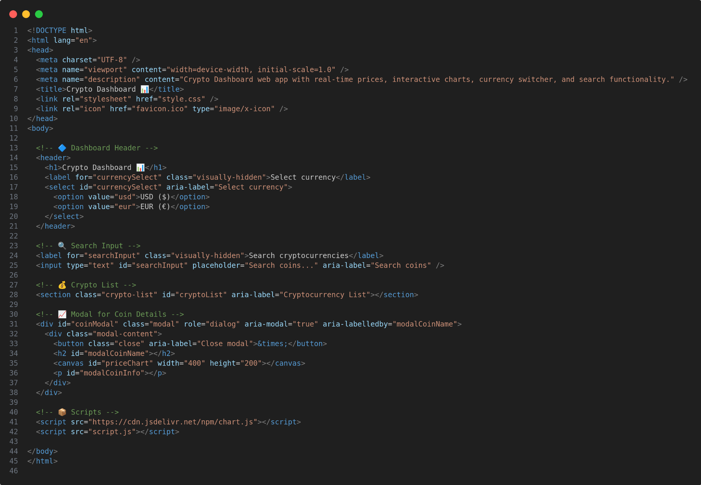

# Crypto Dashboard 📊

**Crypto Dashboard** is a responsive and interactive frontend app for monitoring cryptocurrencies using real-time data.

---

## 🚀 Features

- 🕰️ Real-time data from the [CoinGecko API](https://www.coingecko.com/)
- 🔍 Search functionality
- 💱 Currency switcher (USD / EUR)
- 📊 Weekly price chart using Chart.js
- 🌙 Toggle between Light and Dark mode
- ⚡ Fully responsive design with animations

---

## 📸 Screenshots

### 🧩 HTML Code  
[](screenshots/html.png)

### 🎨 CSS Code  
[](screenshots/css.png)

### ⚙️ JavaScript Code  
[](screenshots/js.png)

---

## 🛠️ Tech Stack

- **HTML5**, **CSS3**, **JavaScript (ES6+)**
- **Chart.js** – for chart rendering
- **CoinGecko API** – for market data

---

## 🧪 How to Run

1. Clone the repository:
   ```bash
   git clone https://github.com/tuo-username/crypto-dashboard.git
   cd crypto-dashboard
crypto-dashboard/
├── index.html
├── style.css
├── script.js
└── screenshots/
    ├── html.png
    ├── css.png
    └── js.png

